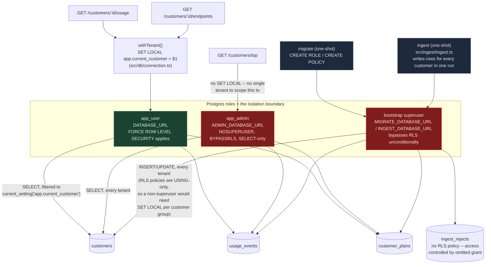

# Architecture: connection/role topology

Multi-tenancy is enforced by *which Postgres role a connection authenticates
as*, not by query text — see ADR
[0001](adr/0001-row-level-security-for-tenant-isolation.md),
[0006](adr/0006-non-superuser-role-for-rls-enforcement.md), and
[0007](adr/0007-admin-role-for-cross-tenant-top-query.md) for the full
reasoning. This diagram exists because that fact doesn't show up by reading
any single query — `src/api/usage.ts` and `src/api/top.ts` run nearly
identical SQL against `usage_events`, and differ only in *which `Kysely`
instance the route was handed at registration* (`db` vs. `adminDb` in
`src/server.ts`). That one-argument difference is the entire tenant-isolation
guarantee for that route, and it's invisible from reading either file in
isolation. `docs/writeup.md` §1/§2 covers the schema and the tradeoffs; this
is the runtime picture those decisions produce.

**Reading the colors:** green (`app_user`) is the only connection actually
subject to RLS — every other path into these tables (red) bypasses it by
design, not by accident. That's the fact worth being able to see at a
glance: two distinct reasons a connection might legitimately not be
RLS-scoped, not one exception that's easy to mistake for a second one — the
admin cross-tenant read (`app_admin`, its own role with its own ADR,
[0007](adr/0007-admin-role-for-cross-tenant-top-query.md)) is a different
kind of exception from the bootstrap superuser shared by `migrate` and
`ingest` (role separation is ADR
[0006](adr/0006-non-superuser-role-for-rls-enforcement.md); *why ingest in
particular* runs as that superuser rather than `app_user` is assumption T7
in `docs/assumptions.md`, not a fourth ADR). `src/db/rls.test.ts` is what
proves the green path actually enforces isolation, not just that the
diagram claims it does.
